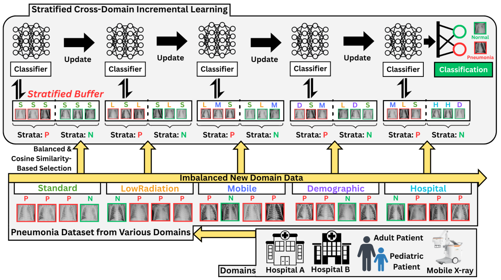
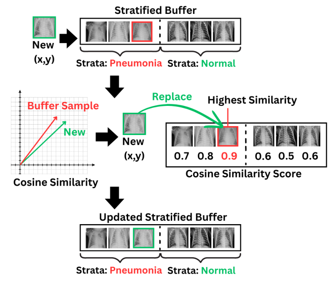
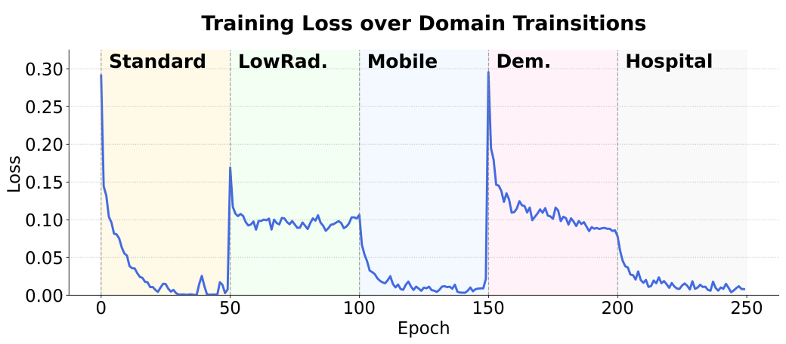

# PneumoX-CL: Similarity-Aware Stratified Replay for Cross-Domain Incremental Pneumonia Detection

This repository contains the code and experimental workflow for the submitted manuscript, **“PneumoX-CL: Similarity-Aware Stratified Replay for Cross-Domain Incremental Pneumonia Detection.”** The implementation is provided to support transparency and reproducibility of the proposed continual learning framework and its evaluation on sequential cross-domain **PneumoniaMNIST** experiments.

---

## Overview

PneumoX-CL is a continual learning framework for **domain-incremental pneumonia detection** under sequential distribution shifts. It is designed to mitigate catastrophic forgetting while preserving adaptation to newly encountered domains in low-resource medical imaging settings.

The framework combines:
- a **stratified class-balanced replay buffer**
- a **similarity-aware sample replacement strategy**
- a **dynamic class-weighted loss**
- evaluation on **five sequentially shifted PneumoniaMNIST domains**

<p align="center">
  
</p>

**Figure 1.** Overview of the PneumoX-CL framework for sequential cross-domain pneumonia detection.

---

## Key Features

- Continual learning for medical imaging under domain shift
- Similarity-aware replay management using cosine similarity
- Class-balanced exemplar retention for more stable rehearsal
- Dynamic class-weighted optimization for improved robustness
- Single-notebook workflow for straightforward reproduction in Google Colab

---

## Method: Similarity-Aware Stratified Replay

PneumoX-CL maintains a class-balanced replay memory and updates stored samples using feature similarity. When the memory budget is reached, incoming candidates are compared against stored representations, and replacement is performed to preserve representative yet diverse exemplars across classes.

<p align="center">
  
</p>

**Figure 2.** Buffer update mechanism based on cosine similarity for similarity-aware exemplar replacement.

---

## Training Behavior Across Domain Transitions

The repository also includes a visualization of optimization behavior across sequential domain transitions, illustrating how learning evolves as the model encounters new distributions.

<p align="center">
  
</p>

**Figure 3.** Training loss dynamics across sequential domain transitions.

---

## Dataset and Sequential Domains

This repository uses **PneumoniaMNIST** from the **MedMNIST** collection. The dataset is downloaded automatically during notebook execution when it is not already present in the designated data directory. In the default Google Colab setting, the data are stored in `/content/data/MedMNIST`. If the dataset has already been downloaded, the notebook reuses the existing files instead of downloading them again.

For clarity, the expected local structure may look like:

```text
data/
└── MedMNIST/
    └── pneumoniamnist.npz
```

The experiments are conducted over **five sequential domains** constructed from PneumoniaMNIST with controlled visual shifts:
1. **Standard**
2. **Low-Radiation**
3. **Mobile**
4. **Demographic**
5. **Hospital**

These domains are designed to emulate realistic chest X-ray distribution shifts that may arise in deployment.

---

## Repository Structure

```text
.
├── PneumoX_CL.ipynb
├── README.md
├── requirements.txt
├── LICENSE
└── assets/
    ├── pneumox-cl_overview.png
    ├── buffer_update.png
    └── training_loss_dynamics.png
```

- `PneumoX_CL.ipynb` — main notebook containing data preparation, domain construction, model training, replay logic, evaluation, and visualization
- `README.md` — project overview and usage instructions
- `requirements.txt` — package dependencies for reproduction
- `LICENSE` — license file
- `assets/` — figures used in this README

---

## Installation

This repository is designed to run conveniently in **Google Colab**.

Install dependencies with:

```bash
pip install -r requirements.txt
```

---

## Quick Start

Open and run:

```text
PneumoX_CL.ipynb
```

To reproduce the main experiments reported in the manuscript, run all notebook cells sequentially.

The notebook includes:
- environment setup
- dataset download and preparation
- sequential domain construction
- baseline continual learning experiments
- PneumoX-CL training
- evaluation and visualization

A GPU runtime in Google Colab is recommended for practical execution time.

---

## Paper-Default Experimental Setting

The notebook is configured to reproduce the paper-default workflow, including:
- **Backbone:** compact 2-stage CNN
- **Optimizer:** Adam
- **Learning rate:** 0.001
- **Batch size:** 32
- **Replay buffer size:** 2000
- **Epochs per domain:** 50
- **Replay ratio:** 1.0
- **Sequential domains:** 5

For exact implementation details, please refer to the notebook cells and in-line comments.

---

## Main Result Summary

Performance comparison reported in the manuscript:

| Method | Accuracy (%) | Forgetting (%) |
|--------|-------------:|---------------:|
| Joint Training (offline reference) | 86.83 ± 0.81 | 0.00 ± 0.00 |
| Fine Tuning | 81.42 ± 0.63 | 6.55 ± 1.02 |
| ER | 85.26 ± 1.25 | 0.80 ± 1.14 |
| CBRS | 86.15 ± 1.34 | 2.23 ± 1.18 |
| **PneumoX-CL** | **87.69 ± 0.23** | **2.23 ± 0.47** |

PneumoX-CL achieves the **highest average accuracy among the continual learning methods evaluated in this repository**, while maintaining **competitive forgetting performance** under sequential domain shifts.

---

## Notes on Reproducibility

- The code is organized as a **single-notebook workflow** for ease of inspection and execution.
- The dataset is **automatically downloaded** if it is not already available locally.
- If an existing local copy of PneumoniaMNIST is present, it is reused.
- For best reproducibility, use the dependency versions listed in `requirements.txt`.
- Google Colab with GPU runtime is recommended.

---

## Associated Paper

**PneumoX-CL: Similarity-Aware Stratified Replay for Cross-Domain Incremental Pneumonia Detection**  
This repository contains the code and experimental workflow for the submitted manuscript. The implementation is provided to support transparency and reproducibility of the proposed continual learning framework and its evaluation on sequential cross-domain PneumoniaMNIST experiments.

A full bibliographic citation will be provided after publication.

---

## Contact

**Danu Kim**  
Korea International School, Jeju Campus  
Email: dukim27@kis.ac

---

## License

This project is released under the license provided in the `LICENSE` file.
